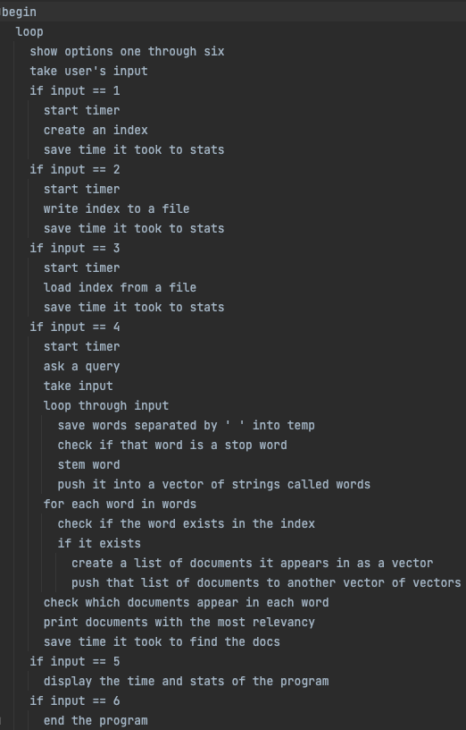
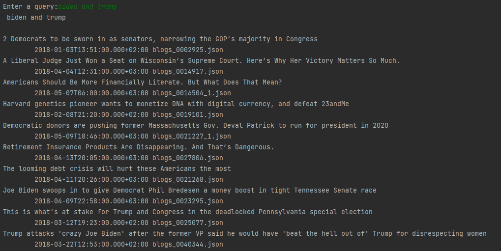

#Documentation

## High-level Design of Solution

### UML Diagram

- UML class diagram, etc.
- High-level pseudo code for each component:
### UserInterface.introduction() including queary loading

### Create an Index

### Write an Index

### Load an Index

    

## Your Timeline to Finish the Project
Weekly milestones/tasks. Set out a plan at the beginning and then record when you got it done.

| Task              | Planned completion | Actual completion | Time spent in hrs by Ryan | Time spent in hrs by Devon |
|-------------------|:------------------:|:-----------------:|:-------------------------:|:--------------------------:|
| UML Diagram       |       Nov 5        |       Nov 5       |             1             |            0.25            |
| Class description |       Nov 5        |       Nov 5       |            0.5            |             0              |
| Word class        |       Nov 12       |      Nov 13       |             1             |            0.25            |
| Document ID       |       Nov 12       |      Nov 13       |            0.5            |             0              |
| AVL tree          |       Nov 12       |      Nov 13       |             2             |             2              |
| AVL map           |       Nov 12       |      Nov 14       |             0             |             2              |
| Tests             |       Nov 12       |      Nov 14       |             0             |             1              |
| Document Parser   |       Nov 20       |       Dec 4       |             7             |             0              |
| Index Handler     |       Nov 27       |       Dec 4       |             1             |             0              |
| User Interface    |       Dec 4        |       Dec 5       |             0             |             2              |
| Query Processor   |       Dec 4        |       Dec 5       |             4             |             3              |
| Documentation     |       Dec 4        |       Dec 5       |             1             |             4              |

## Used Data Structures
Explanation of what data structures are used where:
- DocumentID
  - `Very basic wrapper class containing simple strings and an int`
- Word
  - `A less basic wrapper class containing a string for teh word and an unordered_set for the documents it appeared in. The unordered_set was used because it was the lest complex data structure, with a complexity of O(1), to be used to store unsorted documentIDs and Hashes (which are a struct). The unordered_set was useful due to the circumstance surrounding our needs. We needed the structure to be looped through entirely one time through when used, which means sorting was unnecessary. We could have used a vector but ultimately decided against it because of the larger quantities of data, making a vector less efficient.`
- AVLTree
  - `We used an AVL tree to hold all of our words due to the vastly large amount of words that would be stored. With a time complexity of O(log(n)), the tree came in handy with a very quick sorting method which would allow searching for the word in the tree to go by much faster. A simple solution to this would have been to use a very large array and sort the array, however this would not have functioned as well without a binary search, and sorting such a large amount of words would take much too long.`
- Document Parser
  - Stop Words
    - `We held stop words for the parser to skip over in the files in a set. There wasn't a large amount of stop words but the set of stop words would be iterated over multiple times, meaning the binary search for a set, with a complexity of O(log(n)) was very beneficial to saving time. We could also have used a vector to hold the stop words but because of the same reason as with the AVL tree, it is not as plausible due to the large amount of words.`
- Index Handler
  - `In Index Handler, we used three seperate AVLMaps to hold the indexes for words, organizations, and persons. With a time complexity of O(log(n)), the AVLMap is a very good way to hold a large list of comparables. With the thousands upon thousands of words, it is difficult to find any other way to hold this data except a sorted vector or array, but then the time complexity would be O(n) which is much much worse considering the volume of words stored in these three trees.`
- User Interface
  - `For statistics, two vectors of strings and doubles are used to hold the different queries asked and how long it took to answer them. This gives a time complexity of O(n) which isn't bad due to the low amount of queries asked. However, this could be improved by using an unordered set or creating a wrapper class to hold both variables.`

## User Documentation
- How to use the software:
  - `The software is used in a relatively straightforward way. To begin, the program will prompt the user with a six options. The first will parse a document that the user provides and create an index. The second will write the index to files provided by the user. The third option will load files provided by the user. The fourth processes a query and the fifth shows statistics for the program. Finally, the sixth option is to exit the program.`
- Some example queries with the results:
  
  

## Performance
- Statistics for indexing all documents and timing.
  - `Takes about 50.53 seconds to index 1500 documents`
  - `Takes about 113.348 seconds to index 7000 documents`
  - `Takes about 5.83 hours to index all 306,000 documents`

## Automatic Tests and Memory Tests
You need to describe test cases for:
- Tests for your AVL tree's function:
  - `The tests for the AVL tree are very basic. In a seperate test file, we tested all the functions that we would need including adding a word to the AVL tree, checking to see if a word exists in the AVL tree, clearing the tree, checking to see if the tree was empty, and the rule of three. No other tests were necessary and all were passed.`
- Tests for your AVL tree for memory leaks (don't forget to test the persistence functions)
  - `The AVL tree lacked any memory leaks as indicated when running it with valgrind.`
- Tests for indexer
  - `The indexer has been tested for all of its functions including printing to files, reading from files, reading from large directories, searching for words, returning words, and more. It has passed all of the tests.`
- Tests for the complete system
  - `The complete system has been tested with all six options as well as what happens if there is no index in a file when trying to load from a file, writing to a file with no index, asking multiple queries, and more. It has passed all of the tests`